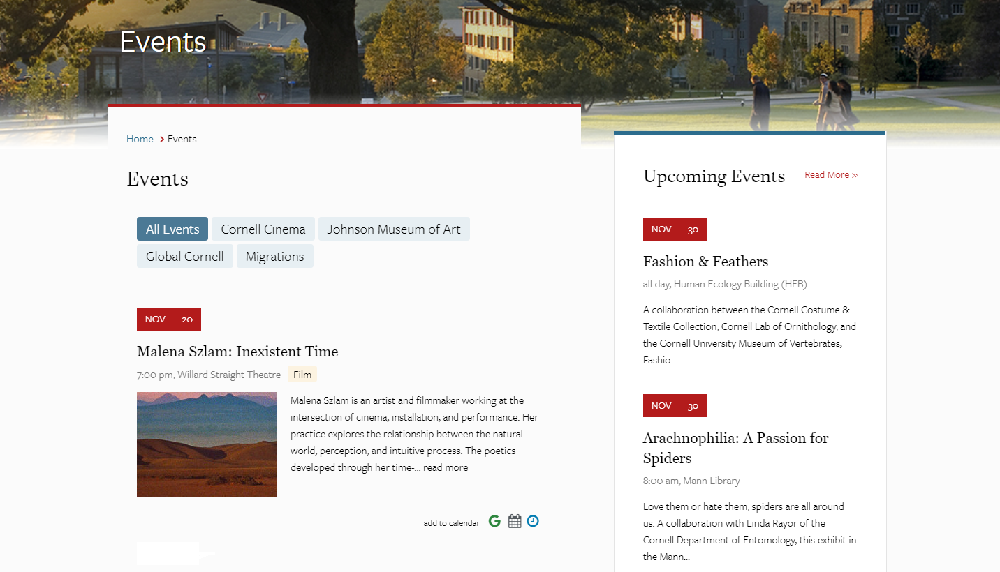
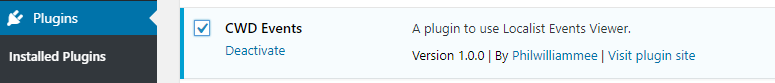
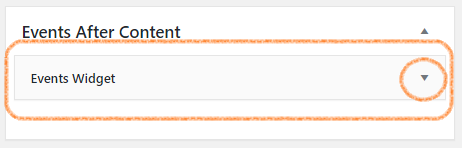

# wp-localist-viewer

*A wordpress plugin to use [Localist Events Viewer](https://github.com/philwilliammee/localist-viewer)*

## How to use this plugin

### Installation

* composer. [example-composer.json](./docs/example-composer.json) : `composer require philwilliammee/wp-localist-viewer:dev-master`

* zip file :
[https://github.com/philwilliammee/wp-localist-viewer/archive/master.zip](https://github.com/philwilliammee/wp-localist-viewer/archive/master.zip)

* repo : [https://github.com/philwilliammee/wp-localist-viewer](https://github.com/philwilliammee/wp-localist-viewer)

Download the plugin and add it to your sites plugins directory.

### Activation

activate the plugin via the wordpress dashboard.

After activation the plugin adds:

1. Events Widget.  

2. Events After Content section  

3. Events After Content template to display widgets section.  

### Configuration

* Add a events widget to Events After Content section and expand the widget to set configuration.  

* Configure the widget for your site.
  * Configuration fields.
    * Unique ID: (string) A unique identifier for the widget.
    * heading: (string) The text heading to display above the widget
    * depts: (number(s)) A single department id or a comma seperated list of ids.
    * entries: (number) The number of events to show.
    * daysahead: ((-)number) The number of days to query for events. Use negative numbers for archive. 365 max, -365 min.
    * format (string option) The view layout for the event.
    * group (number) The group id used by localist api. Used for filtering.
    * keyword (string) Uses keywords or tags to filter events.
    * filterby (string option) Exposed filters.
    * calendarurl (string) The localist events calendar api url
    * apikey (number) Optional API key. not required for get requests.
    * hideaddcal (boolean) Show or hide add to cal links for google,ios, and outlook
    * hidedescription (boolean) Show or hide the event description.
    * truncatedescription (number) The number of characters to show in the description
    * hideimages (boolean) Show or hides event images.
    * hidepagination (boolean) Show or hides the pagination.
    * wrapperclass (string) Class to add to events wrapper.
    * listclass (string) Class
    * itemclass (string) Class
    * readmore (string) Link text to events page.
    * url (string) Link url to events page.
* Create an events page and use the Events After Content Template. (The events will now display on the page)

## For developers

download the repo using git.

modify the page templates in /page-templater/cwd-events-template.php

To modify the css styles go to /src and run `npm install` modify the style in /src/styles/app.scss the styles will need to be compiled go to /src and run then `npm run prod` this will compile the css file and output to cwd-events-component-public.css
