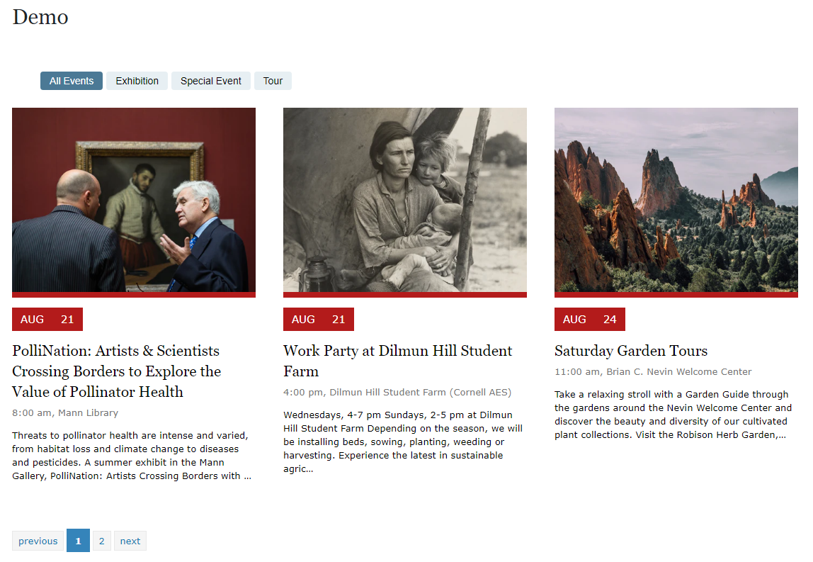

# Localist Viewer

## [Demo Page](https://philwilliammee.github.io/localist-viewer/docs)

[Localist viewer](https://www.npmjs.com/package/localist-viewer) is a ES5 module export for [react-localist-viewer](https://www.npmjs.com/package/react-localist-viewer). It bundles up the react component and exports it as a ES5 module and to the dom as window.Localist

## Getting Started

These instructions will get you a copy of the project up and running on your local machine for development and testing purposes. See deployment for notes on how to deploy the project on a live system.

The rendered viewer does not come with any styling. A starter stlyle sheet can be found [here](https://philwilliammee.github.io/localist-viewer/docs/style.css) or a [complete stylesheet can be found here](https://cu-communityapps.github.io/CD_cwd_events/src/app/css/main.css).

### Prerequisites

Node and NPM http-server.

### Installation Process

Install with NPM: [package/localist-viewer](https://www.npmjs.com/package/localist-viewer)

```bash
npm install localist-viewer
```

Github

```bash
git clone https://github.com/philwilliammee/localist-viewer
```

CDN:

```html
<script src="https://cdn.jsdelivr.net/npm/localist-viewer@latest/build/index.js"></script>
```

## Local Testing

from project root start

```bash
http-server
```

then open browser at [http://localhost:8080/docs/](http://localhost:8080/docs/)

You show see a demo page with test data.



## Deployment

`npm run watch` or `npm run build`

### Example Usage

Demo Code Example

```html
<div id="feature"
    class="events-listing cwd-events-style"
    data-target="feature"
    data-depts="0"
    data-entries="3"
    data-format="modern_compact"
    data-group="0"
    data-keyword=""
    data-heading="Upcoming Events Demo"
    data-calendarurl="./3eventTestData.json"
    data-apikey=""
    data-daysahead="2"
    data-hidedescription="false"
    data-truncatedescription="200"
    data-hideimages="false"
    data-hideaddcal="true"
    data-hidepagination="false"
    data-filterby="none"
    data-wrapperclass="cwd-card-grid three-card"
    data-listclass="cards"
    data-itemclass="card"
    >
</div>
<script src="https://cdn.jsdelivr.net/npm/localist-viewer@latest/build/index.js"></script>
<script>
    const elem = document.getElementById('feature');
    const data = { ...elem.dataset };
    Localist(data);
</script>
```

or import it as a module

```js
import LocalistView from 'localist-viewer';
const elem = document.getElementById('feature');
const data = { ...elem.dataset };
LocalistView(data);
```

See [react-localist-viewer](https://www.npmjs.com/package/react-localist-viewer) proptypes for all configuartion options.


## Versioning

For the versions available, see the [tags on this repository](https://github.com/philwilliammee/localist-viewer/tags) and [tags on this npm](https://www.npmjs.com/package/localist-viewer).

## Authors

**Phil Williammee** - [philwilliammee](https://github.com/philwilliammee)

See also the list of [contributors](https://github.com/philwilliammee/localist-viewer/graphs/contributors) who participated in this project.

## License

This project is licensed under the GNU General Public License v3.0 - see the [LICENSE.md](https://github.com/philwilliammee/localist-viewer/blob/master/LICENSE) file for details

## Acknowledgments
